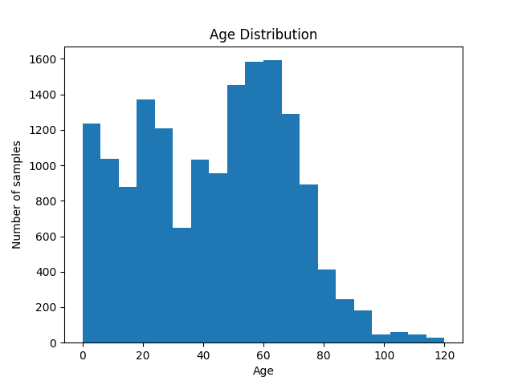
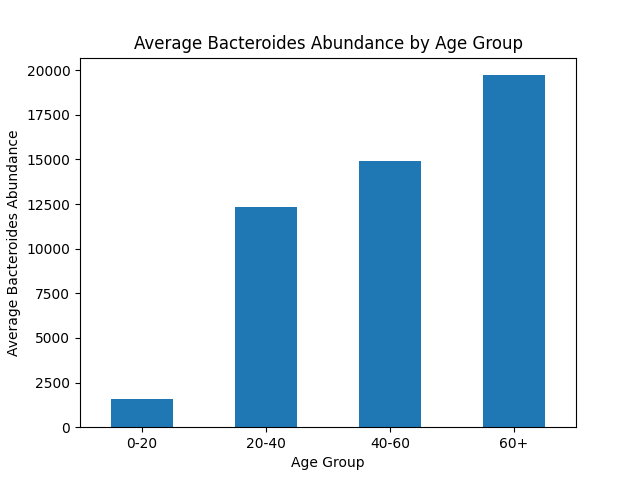
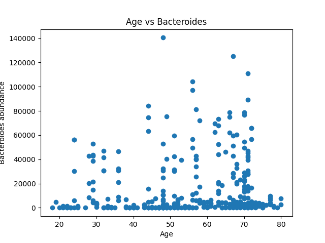
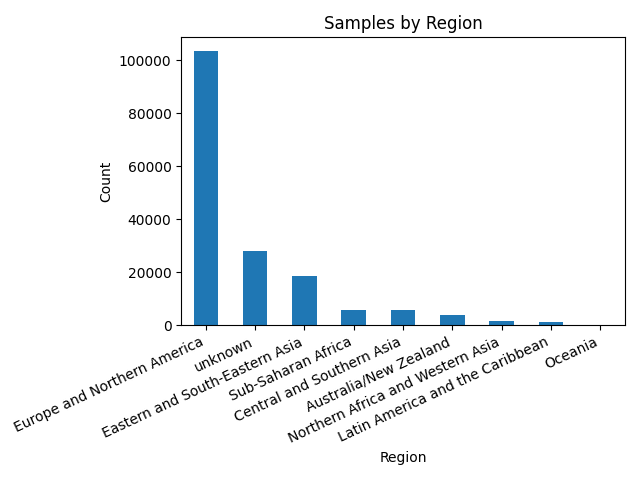
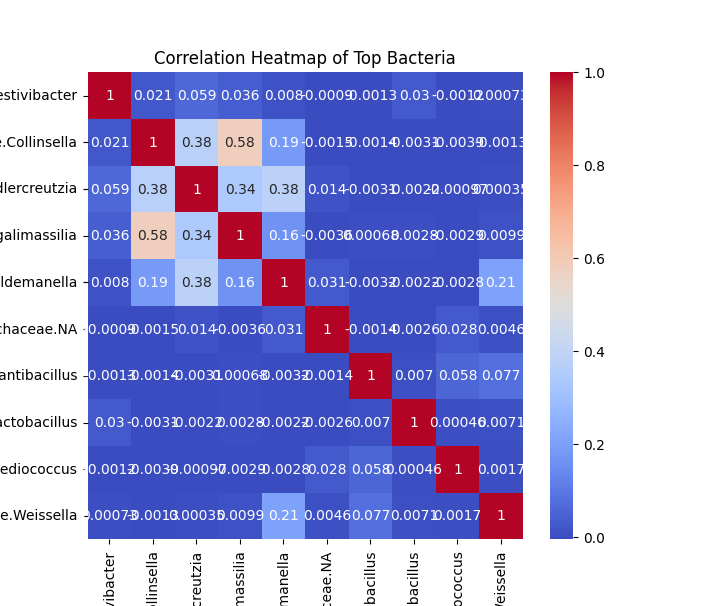
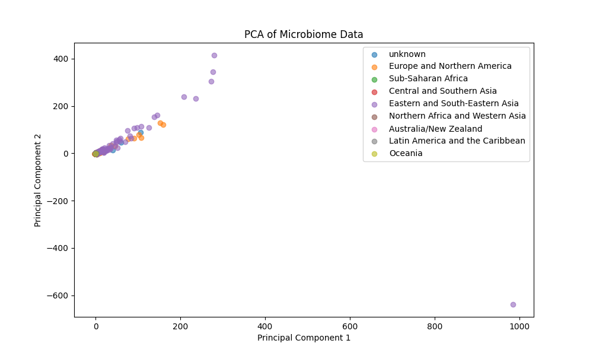
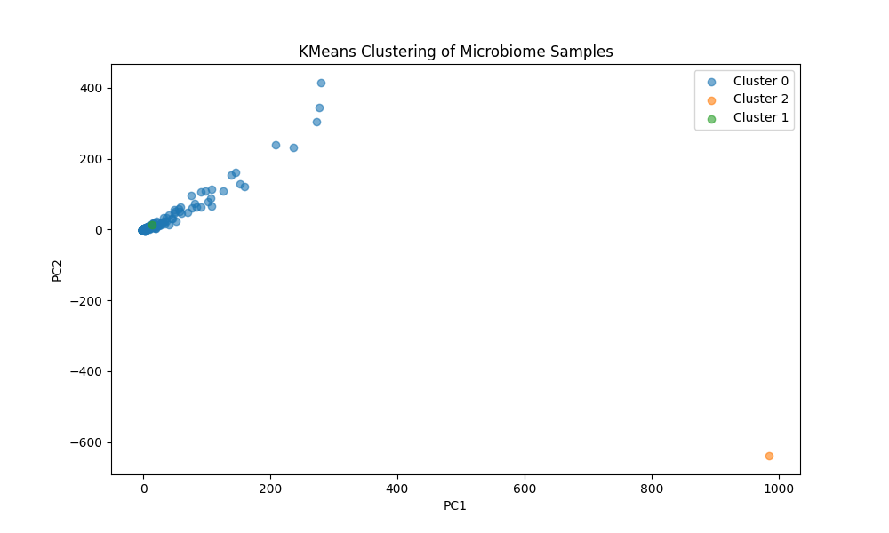
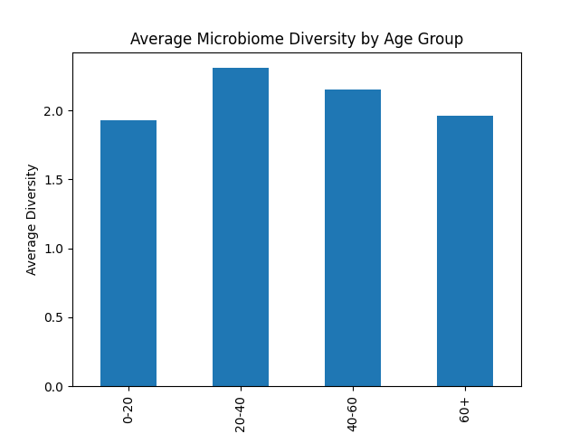
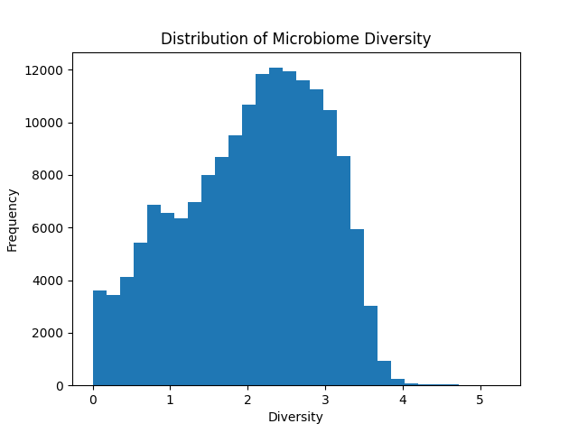

# Age, Geography and the Microbiome: Are We Really Different?

## Project Description

This project analyzes microbiome data using Python.

The analysis includes:
- Age analysis
- Region analysis
- Correlation analysis
- PCA visualization
- KMeans clustering
- Diversity analysis

Libraries used:
- pandas
- matplotlib
- seaborn
- sklearn
- scipy

---

## Dataset Information
Dataset source:
This project uses microbiome datasets from Zenodo:
https://zenodo.org/records/15122187

Files used:
- taxonomic_table.csv.gz
- sample_metadata.tsv
- tags.tsv.gz

---

# 1. Age Analysis

We analyzed how microbiome bacteria change across different age groups.

Age groups:
- 0-20
- 20-40
- 40-60
- 60+

## Visualizations

### Age Distribution

### Average Bacteroides by Age Group

### Age vs Bacteroides

### Findings

- Bacteroides abundance generally increases with age.
- The 60+ age group showed the highest abundance.
- Younger groups had lower abundance values.

---

# 2. Region Analysis

Samples were grouped by region.

Regions:
- Eastern and South-Eastern Asia
- Sub-Saharan Africa
- Unknown

## Visualization

### Findings

- Most microbiome samples are from Eastern and South-Eastern Asia.
- Sub-Saharan Africa contains fewer samples.
- Different regions show different microbiome patterns.

---

# 3. Correlation Analysis

Correlation heatmaps were used to analyze relationships between bacteria.

## Visualization

### Findings

- Some bacteria show strong positive correlations.
- Other bacteria have weak or negative correlations.
- Correlation analysis helps identify bacteria that appear together.

---

# 4. PCA Analysis

PCA (Principal Component Analysis) was used for dimensionality reduction and microbiome visualization.

## Visualization

### Findings

- Most samples cluster together.
- Several outliers are separated from the main group.
- PCA helps visualize similarities between microbiome samples.

---

# 5. Clustering Analysis

KMeans clustering was applied to microbiome samples.

## Visualization

### Findings

- Most samples belong to one large cluster.
- Smaller clusters represent unique microbiome profiles.
- Clustering helps group similar samples together.

---

# 6. Diversity Analysis

The Shannon Diversity Index was calculated for each microbiome sample.

## Visualizations

### Diversity by Age Group

### Diversity Distribution

### Age vs Microbiome Diversity

### Findings

- Diversity differs between age groups and regions.
- The 20-40 age group showed the highest diversity.
- Sub-Saharan Africa showed slightly higher average diversity.
- Diversity values are mostly concentrated between 2 and 3.

---

# Final Conclusion

This project successfully analyzed microbiome data using:
- statistical analysis
- clustering
- PCA
- diversity metrics
- visualization techniques

The results show that:
- age influences microbiome composition
- microbiome diversity changes across age groups
- different regions contain different microbiome patterns
- PCA and clustering can successfully group similar samples

This project demonstrates how Python can be used for microbiome and bioinformatics data analysis.