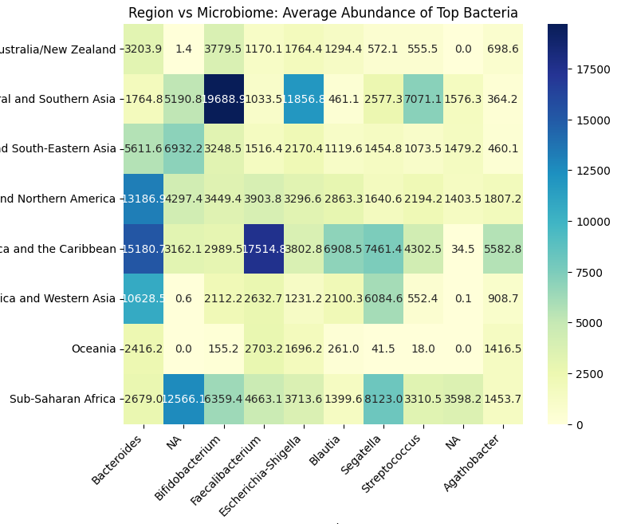
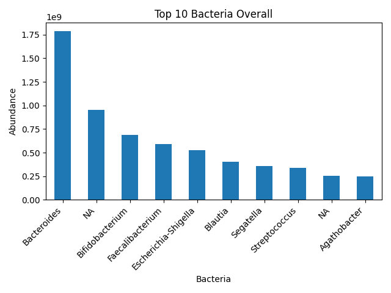
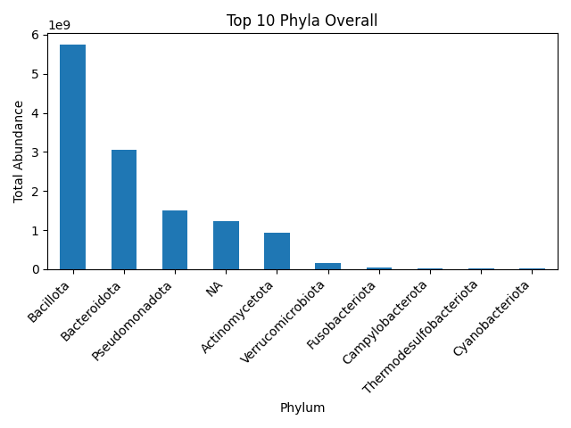
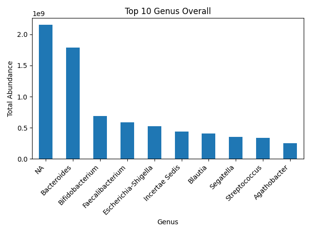
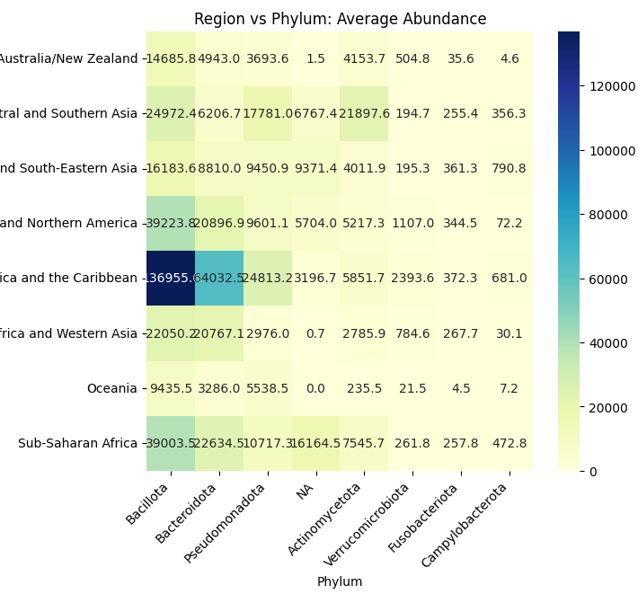
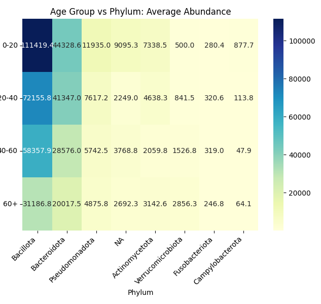
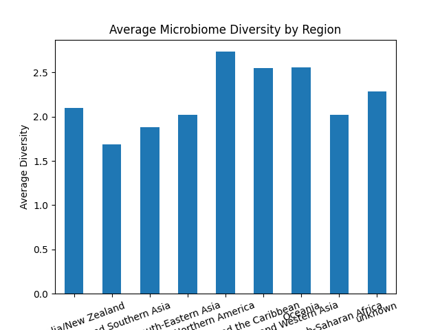

# Age, Geography and the Microbiome: Are We Really Different?

## Project Idea

This project investigates whether differences in the human microbiome are more related to age or to geographical/lifestyle-related factors such as diet, culture, environment and living conditions.

The analysis starts with basic dataset exploration and then moves deeper into bacterial abundance, taxonomy, diversity, PCA, clustering and comparison between age-based and region-based microbiome patterns.

---

## Research Question

Are microbiome differences between people explained more by age, or by geography and lifestyle-related factors?

---

## Hypothesis

The hypothesis is that geography and lifestyle-related factors have a stronger influence on microbiome composition than age alone.

This is because people from different regions often have different diets, environments, cultural habits and lifestyles, which may affect the structure of the gut microbiome.

---

## Dataset Information

Dataset source:  
https://zenodo.org/records/15122187

Files used:
- taxonomic_table.csv.gz
- sample_metadata.tsv
- tags.tsv.gz

The dataset contains microbiome abundance data, sample metadata, age information and geographical region information.

---

## Analysis Workflow

The project follows this structure:

1. Dataset overview  
2. Age-based microbiome analysis  
3. Region-based microbiome analysis  
4. Bacterial abundance analysis  
5. Taxonomy analysis  
6. Bacteria similarity and correlation analysis  
7. PCA and clustering  
8. Diversity analysis  
9. Age vs geography comparison  
10. Future machine learning testing  

---

# 1. Dataset Overview

Before analyzing the microbiome, the dataset was explored to understand the available age values, regions and bacterial abundance columns.

## Samples by Region

### Findings

- The dataset is not balanced across regions.
- Most samples come from Europe and Northern America.
- A large number of samples have unknown region information.
- Some regions, such as Oceania, have very few samples, so their results must be interpreted carefully.

---

# 2. Age-Based Microbiome Analysis

This part analyzes whether microbiome composition changes with age.

The samples were divided into four age groups:

- 0–20
- 20–40
- 40–60
- 60+

## Age Distribution

### Findings

- The dataset contains samples from a wide age range.
- Most samples are from adults and older adults.
- This allows comparison between younger, adult and older individuals.

---

## Age vs Bacteroides

### Findings

- The relationship between age and Bacteroides abundance is weak.
- The correlation between age and Bacteroides is close to zero.
- This suggests that age alone does not strongly explain Bacteroides abundance.

---

## Average Bacteroides by Age Group

### Findings

- Bacteroides abundance is highest in the 20–40 age group.
- It does not increase consistently with age.
- This suggests that microbiome composition may change with age, but not in a simple linear way.

---

## Top Bacteria by Age Group

The most abundant bacteria were also compared across age groups.

### Findings

- Some bacteria appear across all age groups, suggesting a shared core microbiome.
- However, their abundance differs between age groups.
- Younger individuals and older individuals show different microbiome patterns compared to adult groups.

---

# 3. Region-Based Microbiome Analysis

This part analyzes whether microbiome composition differs between geographical regions.

Regions can reflect lifestyle-related factors such as diet, environment, culture and living conditions.

## Region vs Microbiome

### Findings

- The average abundance of dominant bacteria differs across regions.
- Europe and Northern America show high abundance of Bacteroides.
- Latin America and the Caribbean show high abundance for several dominant bacteria.
- Central and Southern Asia and Sub-Saharan Africa show different bacterial patterns.
- These differences suggest that geography and lifestyle-related factors may influence microbiome composition.

---

# 4. Bacterial Abundance Analysis

This part identifies the most dominant bacteria in the dataset.

## Top 10 Bacteria Overall

### Findings

- Bacteroides is the most dominant genus in the dataset.
- Other highly abundant bacteria include Bifidobacterium, Faecalibacterium, Escherichia-Shigella, Blautia, Segatella, Streptococcus and Agathobacter.
- The microbiome is not evenly distributed; a smaller number of bacteria dominate the dataset.

---

# 5. Taxonomy Analysis

Instead of analyzing only individual bacteria, this part groups bacteria by taxonomy levels.

The main taxonomy levels used are:

- Phylum
- Class
- Order
- Family
- Genus

This helps understand whether differences appear only in specific bacteria or also in larger bacterial groups.

---

## Top 10 Phyla Overall

### Findings

- Bacillota and Bacteroidota are the most dominant phyla.
- These broad bacterial groups represent a large part of the microbiome dataset.
- This shows that microbiome patterns can be analyzed not only at genus level, but also at higher taxonomy levels.

---

## Top 10 Genus Overall

### Findings

- Bacteroides is the most dominant genus.
- Bifidobacterium and Faecalibacterium are also highly abundant.
- These genera are important for interpreting gut microbiome composition.

---

## Region vs Phylum

### Findings

- Regional differences are visible at the phylum level.
- Some regions show higher abundance of Bacillota and Bacteroidota.
- This suggests that geographical differences are not only visible in individual bacteria, but also in larger bacterial groups.

---

## Age Group vs Phylum

### Findings

- Age groups show differences in phylum-level abundance.
- The 0–20 group shows different values compared to adult groups.
- However, age-based differences appear less distinct than region-based differences.

---

# 6. Diversity Analysis

Shannon Diversity Index was calculated for each microbiome sample.

This measures how diverse the microbiome is within a sample.

---

## Diversity by Age Group

### Findings

- The 0–20 age group has the lowest microbiome diversity.
- Diversity is higher in adult age groups.
- The 60+ group shows slightly lower diversity than adults.
- This suggests that microbiome diversity increases with maturity and may slightly decline in older age.

---

## Diversity by Region

### Findings

- Microbiome diversity differs across regions.
- Latin America and the Caribbean show the highest average diversity.
- Central and Southern Asia show the lowest average diversity.
- Regions with very small sample sizes should be interpreted carefully.

---

## Diversity Distribution

### Findings

- Most samples have moderate microbiome diversity.
- Very low and very high diversity values are less common.
- This suggests that most microbiome samples are concentrated around a normal diversity range.

---

# 7. Bacteria Similarity and Correlation Analysis

Correlation analysis was used to check which bacteria tend to appear together.

## Correlation Heatmap

### Findings

- Some bacteria show moderate positive correlations.
- Most bacterial pairs show weak correlations.
- This suggests that the microbiome is a complex ecosystem, not a simple relationship between only two bacteria.

---

# 8. PCA and Clustering

PCA and KMeans clustering were used to visualize similarities between microbiome samples.

---

## PCA Visualization

### Findings

- Most samples are grouped close together.
- Some samples appear as outliers.
- This suggests that many individuals share a core microbiome structure, while some have distinct microbiome profiles.

---

## KMeans Clustering

### Findings

- Most samples belong to one dominant cluster.
- Smaller clusters represent unusual microbiome profiles.
- This supports the idea that there is a shared core microbiome, but also outlier patterns.

---

# 9. Age vs Geography Comparison

The age-based analysis shows that age affects microbiome diversity, especially when comparing younger individuals with adults and older adults.

However, age alone does not strongly explain the abundance of specific bacteria such as Bacteroides.

The region-based analysis shows clearer differences in:

- bacterial abundance
- microbiome diversity
- taxonomy-level patterns
- region vs microbiome heatmaps

These results suggest that geography and lifestyle-related factors may have a stronger influence on microbiome composition than age alone.

---

# 10. Biological Interpretation of Key Bacteria

Some of the most important bacteria found in the dataset include:

| Bacteria | Interpretation |
|---|---|
| Bacteroides | Common gut bacteria associated with carbohydrate metabolism and gut microbial balance |
| Bifidobacterium | Often associated with digestion, probiotics and gut health |
| Faecalibacterium | Frequently associated with healthy gut balance and anti-inflammatory effects |
| Blautia | Associated with fermentation and short-chain fatty acid production |
| Escherichia-Shigella | A group that includes both normal and potentially pathogenic bacteria |
| Segatella | Often discussed in relation to plant-rich or carbohydrate-rich diets |
| Streptococcus | A broad genus that includes both normal and potentially harmful species |
| Agathobacter | Associated with butyrate production and gut environment |

These interpretations are used only as biological context. The analysis does not claim that any bacteria directly causes a disease.

---

# Final Conclusion

This project explored whether microbiome differences are more strongly associated with age or with geography and lifestyle-related factors.

The results show that:

- age influences microbiome diversity
- age alone does not strongly explain specific bacterial abundance
- geographical regions show clearer microbiome differences
- dominant bacteria differ between regions
- taxonomy-level analysis also shows regional differences
- microbiome diversity varies across both age groups and regions

Overall, the results suggest that the human microbiome is shaped by both age and environment, but geographical and lifestyle-related factors appear to produce stronger differences in this dataset.

---

# Future Work

Future improvements may include:

- machine learning classification models
- predicting region from microbiome composition
- predicting age group from microbiome composition
- deeper taxonomy analysis by family and genus
- analysis of diet-related metadata if available
- balancing the dataset across regions